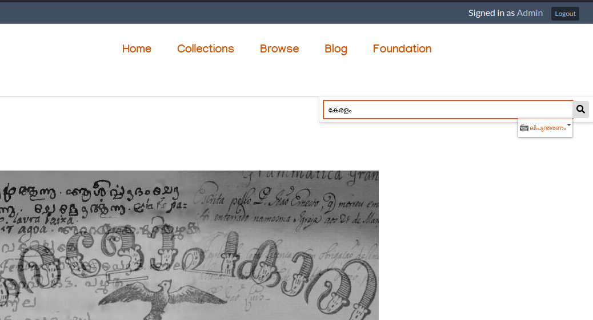
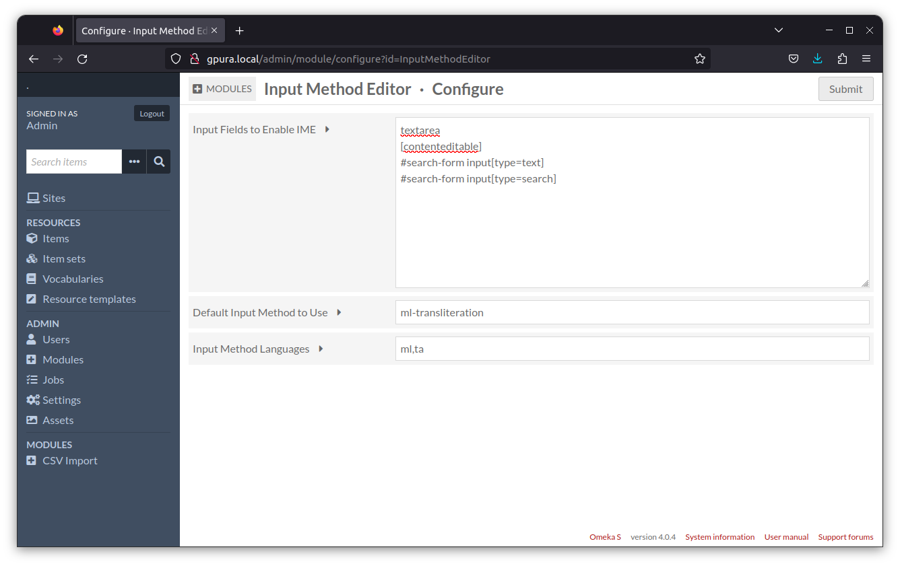

# Omeka S Input Method Editor

This module brings facility to type in any language in Omeka S without having any special support from hardware or Operating System we use.

It does it by integrating [jQuery IME](https://github.com/wikimedia/jquery.ime/).

Thus it brings ability to type with more than 220 input methods across more than 120 languages.

## Features
- Restrict languages to be used for typing.
- Set default language
- Set default input method to use.
- Fine control what input fields are to have the IME facility.

## Installation

See general end user documentation for [Installing a module](http://omeka.org/s/docs/user-manual/modules/#installing-modules)

## Screenshot

- Typing

- Admin

